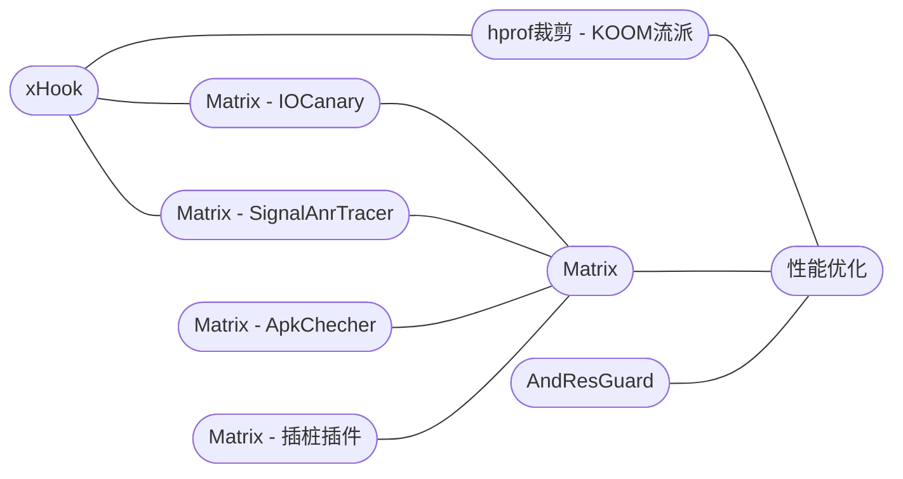

???+ info "提示"
    <small >此博客托管在GitHub Pages ，直连效果可能不佳。</small>  

??? tip "导航快捷键"    
    <small>++f++ , ++s++ , ++slash++ : 开始搜索</small>  
    <small>++esc++ , ++tab++ : 关闭搜索</small>  
    <small>++arrow-down++ , ++arrow-up++ : 选择搜索结果</small>  
    <small>++enter++ : 确定搜索结果</small>  
    <small>++p++ , ++comma++ : 下一页</small>  
    <small>++n++ , ++period++ : 上一页</small> 

???+ quote "&nbsp;"
    Good artists copy; Great artists steal.

## 上新

- [最常用的PLT Hook框架：xHook](/android/3rd-library/xhook)
- [剖析hprof文件的两种主要裁剪流派](/android/3rd-library/hprof-shrink/)
- [AndResGuard资源混淆原理浅析](/android/3rd-library/andresguard)
- [Matrix-ApkChecker：安装包分析检测工具](/android/3rd-library/matrix-apk-checker)
- [浅析AGP+ASM：Matrix插桩插件解析](/android/3rd-library/matrix-trace-plugin)
- [微信开源APM框架——Matrix源码解析](/android/3rd-library/matrix)

 

新品文章关系图，label 点击可跳转

